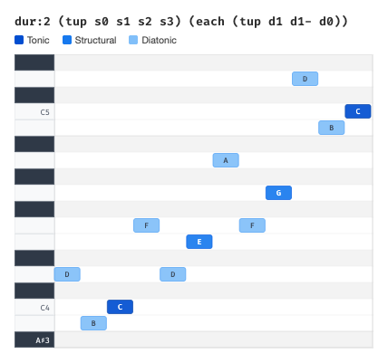
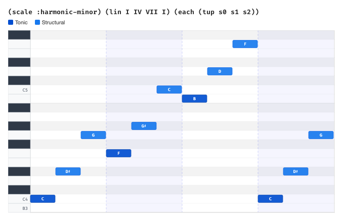

# Noon — Composing Music with Clojure

> Draft article for Clojure Civitas

## What is Noon?

Noon is a Clojure library for composing and playing MIDI music. The name comes from French — "noon" translates to "MIDI."

The motivation is simple: digital audio workstations (DAWs) are powerful but slow. The feedback loop — click, drag, listen, repeat — doesn't match how musicians actually think about music. Musicians think in terms of scales, intervals, chord progressions, melodic contour. Noon tries to bring that level of abstraction into code.

## The Core Model

A noon score is a set of event maps. That's it. Each event represents a MIDI note with properties like position, duration, velocity, and pitch:

```clojure
noon.events/DEFAULT_EVENT
;; => {:position 0, :duration 1, :channel 0, :track 0,
;;     :velocity 80, :pitch {...}, :voice 0, :patch [0 4]}
```

A fresh score contains a single event — middle C:

```clojure
(score)
;; => #{{:position 0, :duration 1, ...}}
```

Everything in noon is a **transformation** — a function from score to score. You build music by composing transformations:

```clojure
(play dur2 (tup s0 s1 s2 s3))
```

This plays an ascending arpeggio at double duration. `dur2` doubles the duration, `tup` splits it into equal parts, and `s0` through `s3` are structural intervals (more on those soon).

## Building Blocks

Three core functions handle most of the composition:

**`lin`** — concatenate transformations in sequence (a melody):

```clojure
(play (lin C0 E0 G0 B0))
```

**`par`** — stack transformations simultaneously (a chord):

```clojure
(play (par C0 Eb0 G0))  ; C minor chord
```

**`tup`** — like `lin`, but fitted to the current duration (a tuplet):

```clojure
(play (tup c0 c3 c7 c10))  ; four notes in the space of one
```

These compose freely. A chord progression with arpeggios:

```clojure
(play (lin I IV V I)
      (each (tup s0 s1 s2)))
```

And transformations can be chained using vectors:

```clojure
(play [dur:2 (lin C0 E0 G0)])
```

A few more useful combinators:

- `rep` — repeat a transformation accumulating results: `(rep 8 d1)` plays 8 ascending scale steps
- `dup` — duplicate a score n times: `(dup 4)` repeats 4 times
- `each` — apply a transformation to every event individually
- `chans` — like `par` but on separate MIDI channels (for different instruments)

```clojure
(play
 (chans
  [(patch :ocarina) (tup s0 s1 s2 s3) (rep 4 s1)]
  [(patch :vibraphone) vel3 (par s0 s1 s2)]
  [(patch :acoustic-bass) o1-])
 (dup 4))
```

## How Musicians Think About Pitch

Before diving into noon's harmonic system, let's consider how musicians actually think about notes.

When a jazz musician sees a G7 chord symbol, they don't think "play MIDI notes 55, 59, 62, 65." They think: "root, third, fifth, seventh — in G mixolydian." If the chord changes to Gm7, they adjust their mental framework — same structure, different scale. The *relationships* between notes matter more than the notes themselves.

This is a crucial distinction. Most music software works at the lowest level — absolute pitches, raw MIDI numbers. But musicians navigate a hierarchy of abstractions:

- "Go up a semitone" — **chromatic** thinking
- "Go to the next note in the scale" — **diatonic** thinking
- "Go to the next chord tone" — **structural** thinking
- "Go to the next octave" or "change the key" — **tonic** thinking

Noon encodes this hierarchy directly.

## The Four Layers

Noon's harmonic system is built on four layers, each one selecting from the layer below:

**1. Chromatic** — the 12 semitones of an octave: `[0 1 2 3 4 5 6 7 8 9 10 11]`

This is the raw material — every possible note.

**2. Diatonic** — a selection of the chromatic layer forming a scale: `[0 2 4 5 7 9 11]`

This is the major scale — 7 of the 12 chromatic notes. Change this and you're in a different scale (dorian, melodic minor, etc.).

**3. Structural** — a selection of the diatonic layer forming a chord: `[0 2 4]`

This picks the 1st, 3rd, and 5th degrees of the scale — a triad. Change this and you get a different chord shape (tetrad, sus4, etc.).

**4. Tonic** — the root: `[0]`

The single reference point everything is built from.

Each event in a noon score carries this full context under its `:pitch` key:

```clojure
(:pitch noon.events/DEFAULT_EVENT)
;; => {:scale     [0 2 4 5 7 9 11]   ; C major
;;     :structure [0 2 4]             ; triad
;;     :origin    {:d 35, :c 60}      ; middle C
;;     :position  {:t 0, :s 0, :d 0, :c 0}}
```

The `:position` map holds an offset at each layer. This is where the note actually *is* within the harmonic context.

## Steps

Each layer has a corresponding **step** operation. A step moves you to the next position *on that layer*:

```clojure
(play (tup c0 c1 c2 c3 c4 c5 c6))    ; chromatic: semitone by semitone
(play (tup d0 d1 d2 d3 d4 d5 d6))    ; diatonic:  scale degree by degree
(play (tup s0 s1 s2 s3))              ; structural: chord tone by chord tone
(play (tup t0 t1 t2))                 ; tonic: octave by octave
```


The chromatic run gives you all 7 semitones. The diatonic run gives you the major scale. The structural run gives you the arpeggio. The tonic run gives you octaves. Same syntax, different musical meaning — determined by the layer.

Here's the key insight: **steps are always relative to the current harmonic context**. When you change the scale or structure, the same step operations produce different notes:

```clojure
;; Major scale
(play dur:4 (lin d0 d1 d2 d3 d4 d5 d6 d7))

;; Dorian scale — same code, different result
(play dur:4 (scale :dorian) (lin d0 d1 d2 d3 d4 d5 d6 d7))

;; Hungarian scale
(play dur:4 (scale :hungarian) (lin d0 d1 d2 d3 d4 d5 d6 d7))
```


The same goes for structural steps:

```clojure
;; Triad arpeggio
(play (tup s0 s1 s2 s3))

;; Tetrad arpeggio — same code, richer chord
(play (structure :tetrad) (tup s0 s1 s2 s3))
```


## Changing the Context

Several functions let you reshape the harmonic context:

**`scale`** — change the scale:
```clojure
(play (scale :melodic-minor) (rup 8 d1))
```

**`structure`** — change the chord structure:
```clojure
(play (structure :tetrad) (tup s0 s1 s2 s3))
```

**`root`** — change the tonal center:
```clojure
(play (root :Eb) (tup s0 s1 s2))
```

**`degree`** — move to a scale degree (mode change):
```clojure
(play (lin I IV V I) (each (tup s0 s1 s2)))
```


Here `I`, `IV`, `V` are degree changes — they shift the harmonic context so that structural steps target the chord tones of each degree. The `each` function applies the arpeggio pattern to every chord individually.

## Mixing Layers

The real power emerges when you mix layers. Since each event carries the full context, you can navigate between layers freely:

```clojure
;; Structural arpeggio with diatonic passing tones
(play dur:2
      (tup s0 s1 s2 s3)
      (each (tup d1 d1- d0)))
```



This creates a chord arpeggio (`s0 s1 s2 s3`) then decorates each chord tone with upper and lower neighbor scale notes (`d1 d1- d0`). The diatonic steps know which scale they're in; the structural steps know which chord they're targeting. They coexist naturally.

An arpeggiated chord progression in harmonic minor:

```clojure
(play (scale :harmonic-minor)
      (lin I IV VII I)
      (each (tup s0 s1 s2)))
```



## Why This Matters

In most music programming systems, if you want a chord arpeggio, you specify exact intervals: "0, 4, 7 semitones" for major, "0, 3, 7" for minor. If you change the key or the chord quality, you rewrite the intervals.

In noon, `(tup s0 s1 s2)` means "play the first three chord tones" regardless of context. Put it in C major and you get C-E-G. Put it in D dorian and you get D-F-A. Change to a tetrad structure and `s3` appears as the seventh. The code expresses the musical *intent* — "arpeggiate the chord" — and the harmonic context handles the rest.

This mirrors how musicians think. A jazz musician doesn't memorize separate fingerings for every chord in every key. They learn *patterns* — "1-3-5", "approach from below", "enclosure" — and apply them across contexts. Noon works the same way.

---

## TODO

- [ ] Act 3: A small but complete musical example tying everything together
- [x] Generate visuals (piano roll / notation images) for key examples — see `doc/visuals/`
- [ ] Convert to Clay `.clj` namespace format for Civitas
- [ ] Handle audio playback integration with Clay
